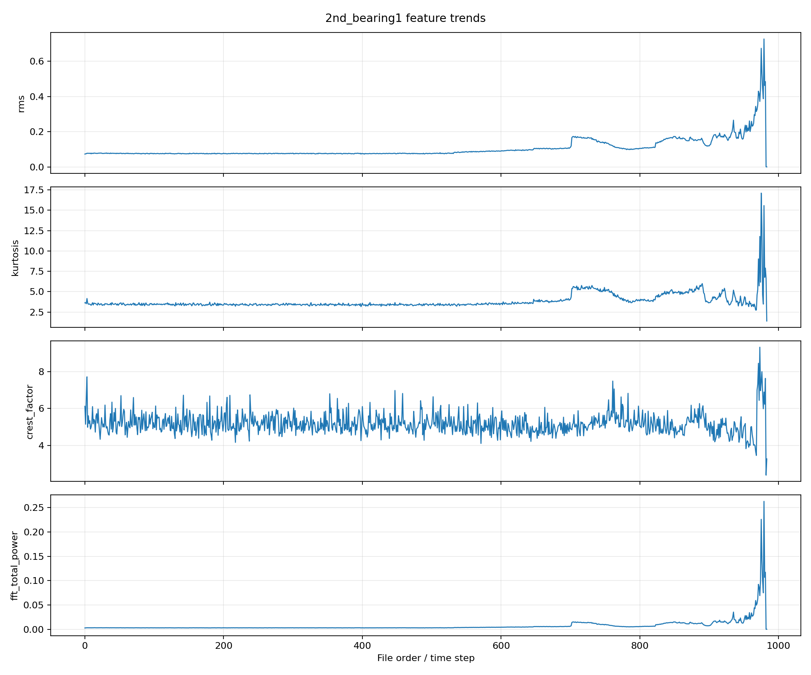
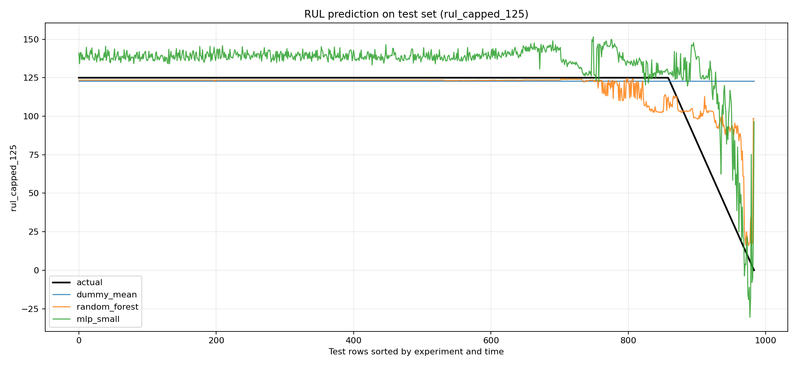
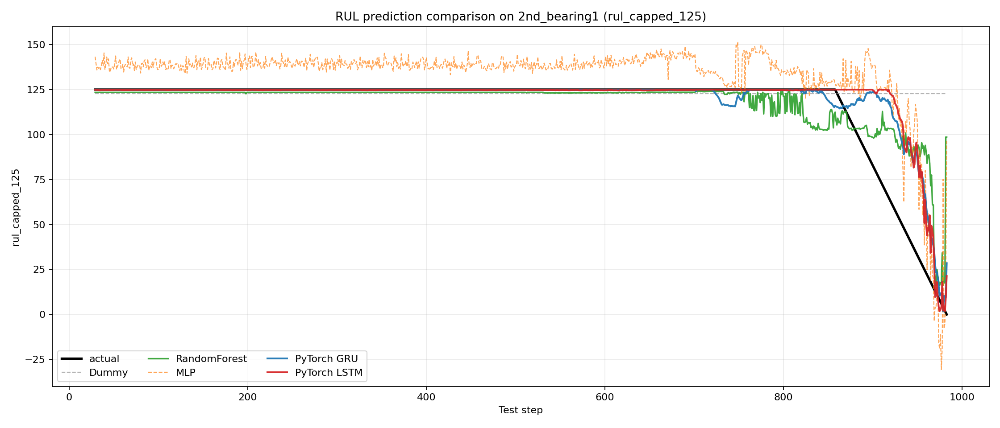
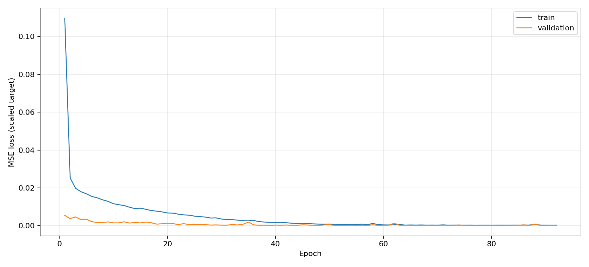
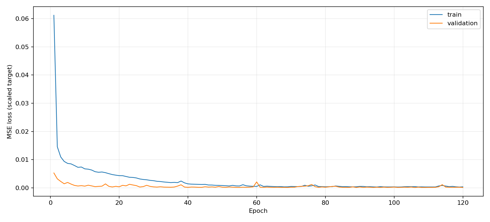

# IMS Bearing Data로 RUL 예측하기

한양대학교 딥러닝 수업 기말 과제로 IMS Bearing Data를 사용해 베어링의 [RUL(Remaining Useful Life)](https://changjinpark.github.io/ims-bearing-rul-prediction/concepts.html#concept-rul)을 예측했다. 처음에는 원본 데이터와 PDF를 봐도 “어느 시점이 고장인지”, “RUL 정답을 어디서 얻는지”, “왜 [RMS](https://changjinpark.github.io/ims-bearing-rul-prediction/concepts.html#concept-rms)나 [FFT](https://changjinpark.github.io/ims-bearing-rul-prediction/concepts.html#concept-fft) 같은 [feature](https://changjinpark.github.io/ims-bearing-rul-prediction/concepts.html#concept-feature)를 뽑는지”가 명확하지 않았다.

이 글은 그 혼란을 정리하면서, 원본 진동 데이터에서 feature를 만들고, RUL 라벨을 직접 생성한 뒤, 비교 기준 모델과 [PyTorch GRU/LSTM 모델](https://changjinpark.github.io/ims-bearing-rul-prediction/concepts.html#concept-gru-lstm)을 비교한 과정을 기록한다.

용어가 낯설면 링크가 걸린 첫 등장 용어를 눌러 개념 설명을 확인하면 된다.

전체 소스 코드는 [GitHub 저장소](https://github.com/changjinpark/ims-bearing-rul-prediction)에서 확인할 수 있다.

## 1. 문제 정의

IMS Bearing Data는 베어링을 고장 날 때까지 운전하며 진동을 측정한 test-to-failure 데이터다. 일반적인 표 형태 데이터처럼 처음부터 “정답 라벨”이 깔끔하게 주어지는 구조가 아니다.

핵심 구조는 다음과 같다.

```text
원본 파일 1개
= 특정 시점에서 측정한 1초짜리 진동 신호
= 약 20,480개의 진동 숫자

파일 이름
= 측정 시각

파일 여러 개
= 시간 순서대로 쌓인 베어링 상태 변화
```

이번 과제의 목표는 다음과 같이 정의했다.

```text
진동 신호에서 통계/주파수 feature를 추출하고,
마지막 고장 시점을 기준으로 RUL 라벨을 만들어,
현재 시점의 남은 수명을 예측한다.
```

## 2. 먼저 정리해야 했던 것

RUL 예측이라고 하면 LSTM이나 GRU 같은 시계열 딥러닝 모델을 먼저 떠올리기 쉽다. 하지만 이 데이터는 처음부터 모델에 넣을 수 있는 표 형태가 아니었다. 먼저 원본 파일을 RUL 예측 문제로 바꾸기 위해 아래 내용을 정리해야 했다.

**데이터 구조: 파일을 시간 순서의 베어링 상태로 어떻게 읽을 것인가**

```text
파일을 시간 순서로 어떻게 정렬하는가
-> 파일 이름이 측정 시각이므로, 이름 순 정렬로 시간 순서를 얻는다.

센서 채널이 어떤 베어링에 대응되는가
-> 한 파일에 여러 채널이 들어 있으므로,
   고장난 베어링의 진동만 골라내려면 채널-베어링 매핑이 필요하다.
```

**학습 대상과 라벨: 무엇을 쓰고 RUL을 어떻게 만들 것인가**

```text
어떤 베어링을 학습 대상으로 쓸 것인가
-> 끝까지 고장나지 않은 베어링은 정확한 failure time을 알 수 없다.
   따라서 최종적으로 고장난 베어링만 사용한다.

RUL 정답을 어떻게 만들 것인가
-> RUL 정답 CSV가 제공되지 않으므로,
   마지막 파일을 RUL = 0으로 두고 라벨을 직접 만든다.
```

**학습 가능성: 이 문제가 정말 풀 수 있는 문제인가**

```text
고장에 가까워질수록 feature가 실제로 변하는가
-> feature가 시간에 따라 의미 있게 변해야,
   모델이 그 변화를 보고 RUL을 추정할 수 있다.
```

앞의 두 묶음은 데이터를 RUL 문제로 구성하는 단계이고, 마지막 묶음은 그렇게 구성한 데이터가 학습 가능한지 확인하는 단계다.

따라서 이번 프로젝트의 흐름은 다음과 같다.

```text
데이터 구조 확인
-> 고장 베어링 선택
-> 각 파일에서 feature 계산
-> 파일 순서로 RUL 라벨 생성
-> feature가 고장 진행과 관련 있는지 확인
-> 모델 학습
```

즉 2장은 어떤 데이터를 어떤 순서로 사용할지 정리한 단계다. 그 다음 3장에서는 선택한 파일 하나하나를 모델 입력으로 쓰기 위해 feature로 바꾸는 과정을 설명하고, 4장에서는 RUL 라벨을 만드는 기준을 설명한다.

## 3. Feature 추출

2장에서 정리한 마지막 질문, 즉 고장에 가까워질수록 feature가 실제로 변하는지 확인하려면 먼저 feature를 정의해야 한다. 한 파일은 약 20,480개의 진동 숫자라 그대로 모델에 넣기에는 길고 노이즈가 많다. 그래서 각 파일을 통계/신호처리 공식으로 요약한 값들로 바꿨다.

이번 프로젝트에서는 시간 영역, 상태 지표, 주파수 영역 feature를 함께 사용했다. 서로 다른 관점에서 베어링 진동 상태를 보기 위해서다.

- 시간 영역 feature: RMS, standard deviation, peak-to-peak, skewness, [kurtosis](https://changjinpark.github.io/ims-bearing-rul-prediction/concepts.html#concept-kurtosis)
- 상태 지표 feature: [crest factor](https://changjinpark.github.io/ims-bearing-rul-prediction/concepts.html#concept-crest-factor), impulse factor, shape factor
- 주파수 영역 feature: FFT total power, dominant frequency, spectral centroid, band energy

여기서 feature는 딥러닝 모델이 학습 과정에서 자동으로 만든 값이 아니라, 사전에 정의한 공식으로 원본 진동 신호를 요약한 값이다.

예를 들어 RMS는 전체 진동 크기를 나타내고, kurtosis는 갑자기 튀는 충격성 정도를 나타낸다. FFT는 시간 기준 진동 신호를 주파수 기준으로 바꿔서 특정 주파수 대역의 에너지를 볼 수 있게 해준다.

아래 그림은 `2nd_bearing1`의 주요 feature가 시간에 따라 어떻게 변하는지 보여준다. 여기서 `2nd_bearing1`은 `2nd_test` 실험의 bearing 1을 뜻하며, 5장에서 다시 데이터 선택 기준을 설명한다.



초반에는 RMS와 FFT power가 비교적 안정적이고, 고장에 가까운 후반부에서 feature 변화가 커진다. 즉 고장 진행에 따라 feature가 변하므로, 이 데이터를 RUL 예측 문제로 접근해볼 수 있다고 판단했다.

## 4. RUL 라벨 생성

이 데이터에는 파일별 RUL 정답 CSV가 따로 제공되지 않는다. 따라서 RUL 라벨은 직접 만들었다.

가장 단순한 가정은 다음과 같다.

```text
마지막 측정 파일 = failure time = RUL 0
현재 파일의 RUL = 마지막 파일까지 남은 파일 개수
```

코드로는 다음과 같은 형태다.

```python
rul_step = total_files - 1 - current_step
```

예를 들어 파일이 총 984개라면:

```text
첫 번째 파일      step = 0   -> rul_step = 983
두 번째 파일      step = 1   -> rul_step = 982
마지막 전 파일    step = 982 -> rul_step = 1
마지막 파일       step = 983 -> rul_step = 0
```

또한 너무 먼 초기 RUL을 그대로 예측하게 하면 학습이 어려울 수 있어서 [capped RUL](https://changjinpark.github.io/ims-bearing-rul-prediction/concepts.html#concept-capped-rul)도 만들었다.

```python
rul_capped_125 = min(rul_step, 125)
```

즉 고장까지 아주 많이 남은 초반 구간은 모두 125로 묶고, 마지막 125개 step에서만 RUL이 감소하도록 만들었다.

## 5. 데이터 선택과 실험 분리

이번 실험에서는 최종 고장이 보고된 베어링만 사용했다.

```text
1st_bearing3
1st_bearing4
2nd_bearing1
3rd_bearing3
```

이 이름은 실험과 베어링 번호를 합친 것이다.

```text
2nd_bearing1
= 2nd_test 실험의 bearing 1

1st_bearing3
= 1st_test 실험의 bearing 3
```

고장나지 않은 베어링은 제외했다. 이유는 RUL이 “고장까지 남은 시간”인데, 실험 끝까지 고장나지 않은 베어링은 정확한 고장 시점을 알 수 없기 때문이다.

최종 평가는 [train/test split](https://changjinpark.github.io/ims-bearing-rul-prediction/concepts.html#concept-split-validation) 중 `by_experiment` split을 사용했다.

```text
train:
1st_bearing3
1st_bearing4
3rd_bearing3

test:
2nd_bearing1
```

`features_combined.csv` 안에는 `2nd_bearing1`도 들어 있지만, 학습 코드에서 `test_df`로 분리되므로 모델 학습에는 사용되지 않는다. 즉 모델은 `2nd_bearing1`을 처음 보는 실험으로 두고 RUL을 예측한다.

## 6. 비교 기준 모델

딥러닝 모델을 바로 평가하면 성능의 의미를 판단하기 어렵다. 그래서 먼저 [baseline, 즉 비교 기준 모델](https://changjinpark.github.io/ims-bearing-rul-prediction/concepts.html#concept-baseline-models)을 만들었다. 여기서 baseline은 최종 모델이 좋은지 나쁜지 판단하기 위한 기준이라는 뜻이다.

Dummy, RandomForest, MLP가 모든 과제에서 반드시 쓰는 정답 조합은 아니다. 이 프로젝트에서는 “아무것도 배우지 않는 모델”, “feature 표에서 강한 전통 머신러닝 모델”, “간단한 신경망”을 차례로 비교하기 위해 선택했다.

```text
DummyRegressor:
평균값만 예측하는 최소 기준선

RandomForestRegressor:
표 형태 feature 데이터에서 강한 전통 머신러닝 모델

MLPRegressor:
한 시점 feature를 입력으로 쓰는 간단한 신경망
```

`by_experiment` split 결과는 다음과 같다. [MAE, RMSE, R2](https://changjinpark.github.io/ims-bearing-rul-prediction/concepts.html#concept-metrics)는 예측이 얼마나 맞았는지 보는 평가 지표다.

| Model | MAE | RMSE | R2 |
|---|---:|---:|---:|
| DummyRegressor | 9.66 | 25.28 | -0.055 |
| RandomForest | 6.24 | 14.36 | 0.659 |
| MLP | 17.03 | 21.08 | 0.266 |

아래 그림은 test로 남겨둔 `2nd_bearing1`, 즉 `2nd_test`의 bearing 1에 대해 실제 RUL과 비교 기준 모델의 예측을 비교한 결과다.



RandomForest는 feature 기반 비교 모델 중 가장 좋은 성능을 보였다. 반면 MLP는 단일 시점 feature만으로는 RandomForest보다 낮은 성능을 보였다.

## 7. PyTorch GRU와 LSTM 모델

위 비교 기준 모델들은 각 시점의 feature 한 줄만 보고 RUL을 예측한다.

```text
step 100 feature 한 줄
-> 모델
-> step 100 RUL 예측
```

GRU와 LSTM은 입력 방식이 다르다. 최근 여러 시점의 feature 흐름을 보고 현재 RUL을 예측한다.

```text
step 71 ~ 100 feature들
-> GRU 또는 LSTM
-> step 100 RUL 예측
```

이번 실험에서는 `window_size = 30`을 사용했다.

```text
step 0 ~ 29 feature들  -> step 29의 RUL 예측
step 1 ~ 30 feature들  -> step 30의 RUL 예측
step 2 ~ 31 feature들  -> step 31의 RUL 예측
```

PyTorch의 `nn.GRU`와 `nn.LSTM`을 사용했고, train sequence 중 일부를 validation으로 분리해 학습 중 과적합 여부를 확인했다. `2nd_bearing1` test 데이터는 최종 평가에만 사용했다.

GRU와 LSTM은 둘 다 시계열 흐름을 다루는 딥러닝 모델이다. LSTM은 오래 전 정보를 기억하기 위한 cell state 구조를 가지고 있고, GRU는 그 구조를 조금 단순화한 모델이다. 이 프로젝트에서는 두 모델이 같은 feature CSV, 같은 train/test split, 같은 `window_size = 30` 조건에서 비교되도록 만들었다.

## 8. 최종 결과

같은 `by_experiment` split에서 모델 성능을 비교하면 다음과 같다.

| Model | MAE | RMSE | R2 |
|---|---:|---:|---:|
| DummyRegressor | 9.66 | 25.28 | -0.055 |
| RandomForest | 6.24 | 14.36 | 0.659 |
| MLP | 17.03 | 21.08 | 0.266 |
| PyTorch GRU | 4.53 | 13.36 | 0.713 |
| PyTorch LSTM | 4.68 | 14.38 | 0.668 |

PyTorch GRU가 가장 좋은 결과를 보였고, LSTM도 RandomForest보다 낮은 MAE를 보였다. 이는 최근 여러 시점의 feature 흐름을 보는 sequence 모델이 단일 시점 feature만 보는 모델보다 RUL 예측에 도움이 될 수 있음을 보여준다.

아래 그래프는 actual, baseline 모델, PyTorch GRU, PyTorch LSTM을 한 장에서 비교한 결과다.



초반 정상 구간에서는 여러 모델이 모두 RUL 125 근처를 예측한다. 차이는 고장에 가까워지는 후반부에서 더 잘 보인다. RandomForest는 하강을 어느 정도 따라가지만 흔들림이 크고, MLP는 전체적으로 불안정하다. GRU와 LSTM은 sequence 흐름을 사용하기 때문에 후반부 하강 구간을 더 직접적으로 따라가며, 이번 실행에서는 GRU가 가장 좋은 성능을 보였다.

학습 중 train loss와 validation loss 변화는 다음과 같다.





## 9. 한계

이번 결과를 실제 산업 현장 성능으로 바로 해석하면 안 된다. 이유는 다음과 같다.

- 고장 실험 수가 4개로 많지 않다.
- 1st/2nd/3rd 실험의 센서 구조와 고장 종류가 완전히 같지 않다.
- RUL 라벨은 제공된 정답이 아니라 “마지막 파일을 failure time으로 본다”는 가정으로 만들었다.
- `rul_capped_125`는 초기 정상 구간을 단순화한 라벨이다.
- Random split 성능은 데이터 누수 가능성이 있으므로 최종 성능으로 보면 안 된다.

따라서 이 프로젝트는 “IMS Bearing Data를 RUL 예측 문제로 구성하고, feature 기반 비교 모델과 sequence 기반 GRU/LSTM을 비교한 과제 실험”으로 해석하는 것이 적절하다.

## 10. 성능 개선 방향

이번 프로젝트에서는 처음 RUL 문제를 이해하고 끝까지 재현 가능한 실험을 만드는 것을 우선했다. 성능을 더 높이거나 실험을 확장하려면 다음 방향을 고려할 수 있다.

```text
1. 하이퍼파라미터 튜닝
   window_size, hidden_size, learning rate, dropout, batch size를 더 넓게 탐색한다.

2. 라벨링 방식 개선
   rul_capped_125의 cap 값을 100, 150, 200 등으로 바꿔 비교한다.
   실제 고장 발생 시점을 더 정교하게 정의할 수 있다면 라벨 품질을 개선할 수 있다.

3. 신호처리 feature 확장
   FFT band를 더 세분화하거나, envelope analysis, wavelet, STFT 같은 방법을 추가할 수 있다.

4. 원본 신호 기반 딥러닝
   feature CSV 대신 원본 진동 파형을 1D-CNN, CNN-LSTM 같은 모델에 직접 넣는 방식도 가능하다.

5. 평가 방식 확장
   하나의 test 실험만 쓰지 않고, leave-one-experiment-out 방식으로 여러 실험을 번갈아 test로 둘 수 있다.
```

이번 과제에서는 난이도와 설명 가능성을 고려해 원본 신호를 바로 딥러닝에 넣는 방식은 사용하지 않았다. 대신 통계/신호처리 feature를 먼저 만들고, 그 feature 흐름을 GRU/LSTM에 넣는 방식으로 접근했다. 이 방식은 성능 최고점을 노리는 접근이라기보다, 데이터 구조와 RUL 라벨링 과정을 이해하기 좋은 접근이다.

## 11. 실행 환경

실행 환경에 따라 학습 시간이나 세부 결과가 조금 달라질 수 있다. 특히 PyTorch 모델은 random seed, CPU/GPU 사용 여부, 라이브러리 버전에 영향을 받을 수 있다.

이번 실험은 다음 환경에서 실행했다.

```text
OS: macOS 14.6.1, arm64
Python: 3.11.0
Device: CPU

numpy: 2.1.3
pandas: 2.3.3
scikit-learn: 1.8.0
matplotlib: 3.10.9
torch: 2.12.0
```

코드에서는 재현성을 위해 `random_state=42`와 PyTorch seed를 설정했다. 다만 딥러닝 학습은 실행 환경에 따라 소수점 단위 결과가 완전히 같지 않을 수 있다.

## 12. 결론

이번 프로젝트를 통해 다음을 확인했다.

```text
1. IMS Bearing Data는 파일 단위 시계열 데이터다.
2. RUL 정답은 직접 라벨링해야 한다.
3. RMS, kurtosis, FFT band energy 같은 feature는 고장 진행을 설명하는 데 유용하다.
4. RandomForest는 강한 feature 기반 비교 기준 모델이다.
5. PyTorch GRU와 LSTM은 최근 feature 흐름을 사용했고, 이번 실행에서는 GRU가 가장 좋은 성능을 보였다.
```

최종적으로 PyTorch GRU는 `by_experiment` 평가에서 MAE 4.53, RMSE 13.36, R2 0.713을 기록했다. PyTorch LSTM은 MAE 4.68, RMSE 14.38, R2 0.668을 기록했다. 이 결과는 고장에 가까워지는 feature의 시간적 변화가 RUL 예측에 의미 있는 정보를 제공할 수 있음을 보여준다.

## 13. 코드

주요 코드는 다음 파일에 정리했다.

전체 프로젝트 저장소: [github.com/changjinpark/ims-bearing-rul-prediction](https://github.com/changjinpark/ims-bearing-rul-prediction)

| 파일 | 역할 |
|---|---|
| [`src/01_make_features.py`](https://github.com/changjinpark/ims-bearing-rul-prediction/blob/main/src/01_make_features.py) | 원본 진동 파일을 feature CSV와 EDA 그래프로 변환 |
| [`src/02_train_baseline.py`](https://github.com/changjinpark/ims-bearing-rul-prediction/blob/main/src/02_train_baseline.py) | Dummy, RandomForest, MLP baseline 학습 |
| [`src/03_train_gru_torch.py`](https://github.com/changjinpark/ims-bearing-rul-prediction/blob/main/src/03_train_gru_torch.py) | PyTorch nn.GRU 기반 sequence 모델 학습 |
| [`src/04_train_lstm_torch.py`](https://github.com/changjinpark/ims-bearing-rul-prediction/blob/main/src/04_train_lstm_torch.py) | PyTorch nn.LSTM 기반 sequence 모델 학습 |
| [`src/05_compare_model_predictions.py`](https://github.com/changjinpark/ims-bearing-rul-prediction/blob/main/src/05_compare_model_predictions.py) | baseline, GRU, LSTM 예측선을 한 장의 그래프로 비교 |

실행 방법과 라이브러리 범위는 `requirements.txt`에 정리했다.
